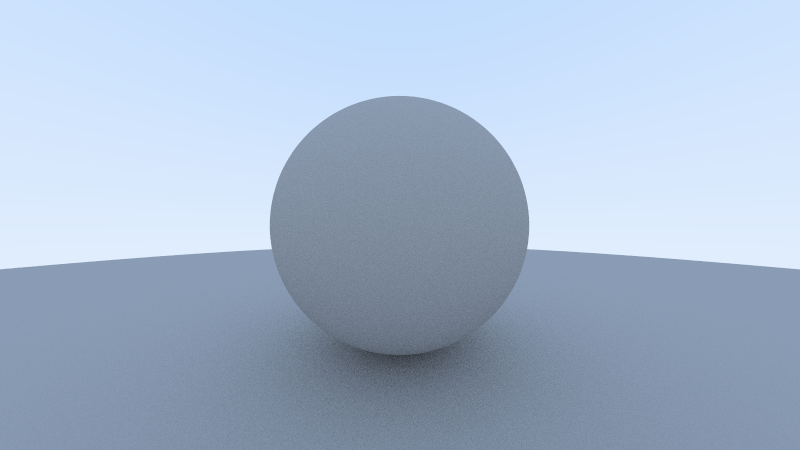

# Ray Tracer

> Implementation of [Ray Shirley's Ray Tracing In One Weekend](https://raytracing.github.io/books/RayTracingInOneWeekend.html)



## Build

You need cargo installed for this which can be done from
[rustup](https://rustup.rs/).

```
git clone https://github.com/samyakahuja/raytracer.git && cd raytracer
cargo run --release
```

It outputs the image to stdout. To save in file redirect it

```
cargo run --release > image.ppm
```

## TODO

- checkout [impl_ops](https://docs.rs/impl_ops/0.1.1/impl_ops/index.html) for
  simplifying operator overloading in `vector.rs`.
- Consider `Rc` for shared pointer in `HittableList`.
